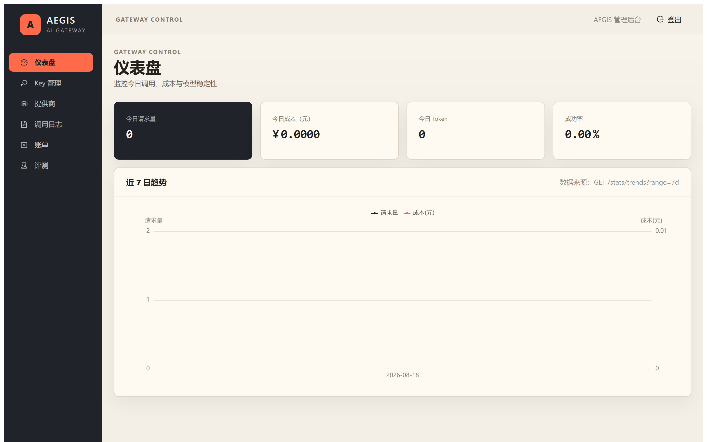
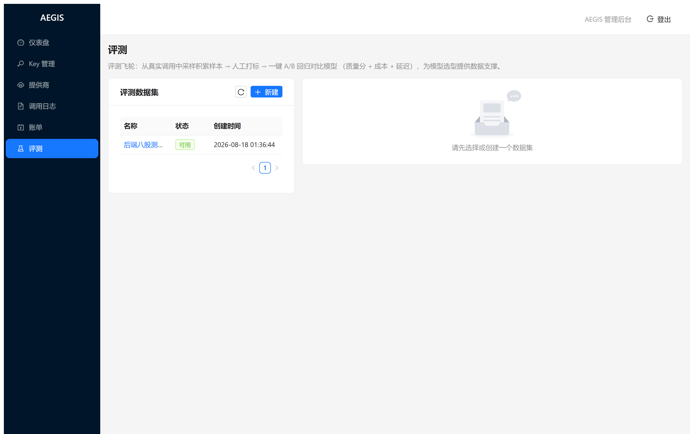
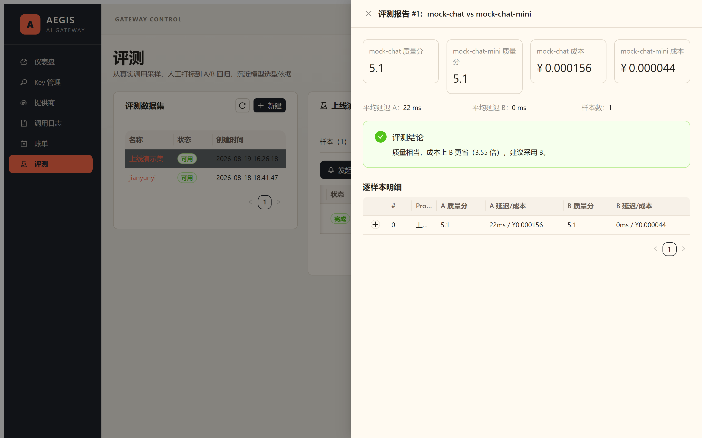
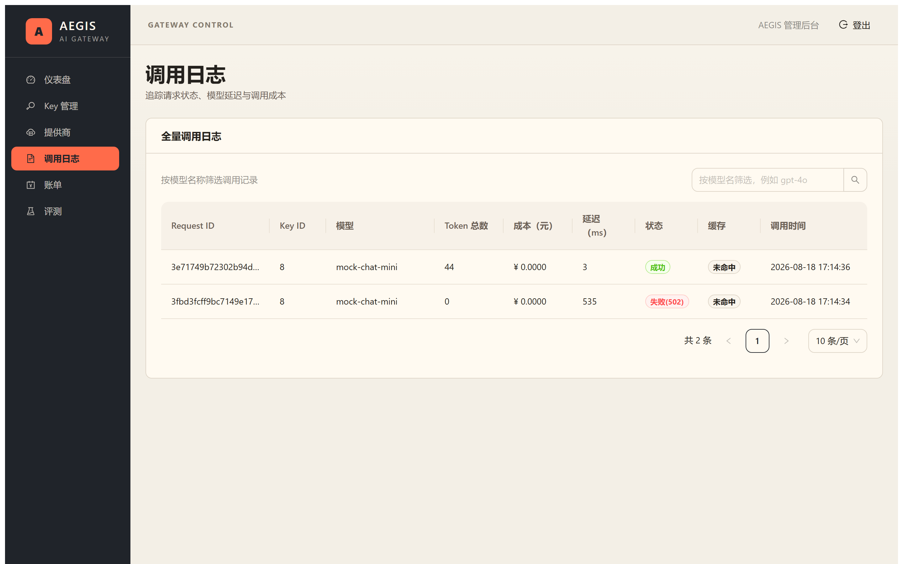

# AEGIS — 企业大模型网关与智能观测平台

> **AEGIS** — An Enterprise LLM Gateway & Intelligence Platform: unified access, routing, rate-limiting, billing, observability, and model evaluation for multiple LLM providers.

🌐 [English README](README.en.md)

统一的企业大模型接入网关：**路由、限流、计费、观测、评测**一站式平台。

[](https://opensource.org/licenses/MIT)
[](https://go.dev/)
[](https://nextjs.org/)
[](https://github.com/jianyunyi/aegis-gateway/actions/workflows/ci.yml)
[](https://docs.docker.com/compose/)

> 定位：AI 的基础设施层。业务方通过 AEGIS 接入多家大模型，获得统一鉴权、成本控制与可观测能力。
> 技术栈：Go + Gin + Gorm + Redis + MySQL ｜ Next.js + React + TypeScript ｜ Docker

## 目录

- [快速开始](#快速开始)
- [功能特性](#功能特性)
- [架构概览](#架构概览)
- [参与贡献](#参与贡献)
- [开源协议](#开源协议)

## 快速开始

```bash
# 1. 一键启动全栈（MySQL + Redis + 网关 + mock 沙箱 + 管理后台）
#    前置：make build-linux（交叉编译，或由 CI 完成）
docker compose -f deploy/docker-compose.yml up -d --build

# 2. 健康检查
curl http://localhost:8081/healthz

# 3. 打开管理后台（浏览器直连 8081 网关 API，CORS 已放行）
open http://localhost:3000        # 默认账号 admin / admin123
```

> 端口约定：网关 `8081`（容器内 8080）、后台 `3000`、MySQL `3303`、Redis `6379`、mock 沙箱 `8099`。
> web 镜像构建需要网络（npm ci，走 npmmirror）；无网络时用 `npm run dev` 本地起后台。

本地开发（不经 Docker）：

```bash
docker compose -f deploy/docker-compose.yml up -d mysql redis   # 只起依赖
cd backend && go run ./cmd/gateway                                # 起网关
cd web && npm install && npm run dev                              # 起后台
```

Windows 无 make 时的命令对照：`make up` → `docker compose -f deploy/docker-compose.yml up -d --build`；`make test` → `cd backend; go test ./... -race`。

## 功能特性

| 能力 | 说明 |
|---|---|
| 统一接入 | OpenAI 兼容协议，任意官方 SDK 改 `base_url` 即接入；SSE 流式逐块转发，记录 TTFT 首字延迟 |
| 安全鉴权 | API Key 哈希存储（明文仅创建时展示一次）；提供商 Key AES-256-GCM 加密；JWT 管理端登录 |
| 限流防滥用 | Redis Lua 令牌桶，每 Key 可配 rps/burst |
| 计费对账 | 按 token 计价 + 调用日志；Redis 计数与 MySQL 流水定时对账（以 MySQL 为准） |
| 可观测 | 大盘（请求量/成本/Token/成功率/延迟）、7/30 天趋势、日志分页查询、每日账单 |
| 成本优化 | 语义路由（Header > Key 默认模型 > 启发式选档）；请求缓存（含路由模型复合键）；月度预算自动降级 + 告警 |
| 评测飞轮 | 真实调用采样 → 人工打标 → A/B 模型回归（质量分 + 成本 + 延迟报告与选型结论） |
| 管理后台 | Next.js + AntD：登录 / 大盘 / Key / 提供商 / 模型 / 日志 / 账单 / 评测 |

## 界面预览

| 管理后台 · 大盘 | 评测 · 样本管理 |
|---|---|
|  |  |

| 评测 · A/B 报告 | 调用日志 |
|---|---|
|  |  |

> 截图由 `scripts/screenshot.mjs` 自动生成（Playwright 无头浏览器，见脚本注释）。

## 架构概览

```
业务方 (OpenAI SDK / curl) ──Bearer ak_xxx──► AEGIS Gateway (Go/Gin)
   中间件链: KeyAuth → RateLimit → 语义路由 → 请求缓存 → 预算降级 → 流式代理
        │                                      │
   Redis(限流/缓存/配额/预算)            MySQL(Key/模型/调用日志/账单/评测)
        │
   上游: OpenAI / DeepSeek / 通义 / Ollama / mock 沙箱（统一 OpenAI 兼容协议）
```

核心设计决策（ADR）与数据库设计见 [docs/03-技术方案设计.md](./docs/03-技术方案设计.md)。

## 目录结构

```
aegis-gateway/
├── docs/          # 全部项目文档（章程/PRD/技术方案/规范/测试/面试素材）
├── backend/       # Go 网关（cmd / internal / migrations）
│   └── internal/  # config / handler / middleware / proxy / routing / service / repository / model
├── web/           # Next.js 管理后台（App Router + AntD）
├── deploy/        # docker-compose / Dockerfile
└── .github/       # GitHub Actions CI
```

## 参与贡献

欢迎提交 Issue 与 PR，请先阅读 [CONTRIBUTING.md](CONTRIBUTING.md) 与 [开发规范](docs/04-开发规范.md)。

## 开源协议

[MIT](LICENSE) © 2026 jianyunyi
